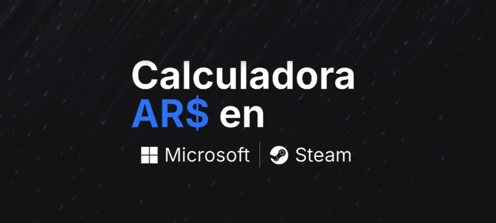

# Calculadorra ARS en Steam y Microsoft



Esta app te permite poder transformar de dolar tarjeta a AR$ y calcular mas inpuesto el valor real que te puede llegar a salir un producto comprado en una de estas plataformas. 

>[!NOTE]
>la aplicacion tiene ciertos problemas de re-renderizado, por falta de tiempo y por situaciones personales no he podido arreglarlos aun. 

## Getting Started

```bash
npm run dev
# or
yarn dev
# or
pnpm dev
# or
bun dev
```

## Testing

```bash
#Test
npm test

#Test Watch
npm test:watch
```

Puerto [http://localhost:3000](http://localhost:3000) 

## Deploy 

[Link de la aplicacion desplegada](https://inpuesto-dolar-steam-microsft.vercel.app/)

## Author
Dario Marzzucco 